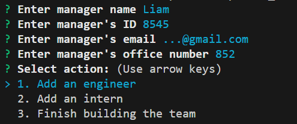

  
# Team builder

## Description
This Node based application allows to generate a dashboard with people working in the organisation

## Table of Contents
- [Description](#description)
- [Installation](#installation)
- [Usage](#usage)
- [License](#license)
- [How to Contribute](#contribute)
- [Tests](#tests)
- [Contact](#contact)

## Installation
Clone the project and use `node index` to run application

## Usage
Run `node index`, fill out people information by answering prompts and check team.html for the results

Example prompt:

## License
This project uses MIT license. Please refer to LICENSE file for more information.

## How to Contribute
No contribution available

## Tests
Run `npm test` to run the tests

## Contact
- **Github address:** github.com/Raam337

